# TAHAP 1 — DATABASE DESIGN & SYSTEM ARCHITECTURE (REVISI AKHIR - NOC & CMMS)
## Lab Inventory & Network Management System

Dokumen ini mendokumentasikan penyempurnaan skema database relasional berskala produksi menggunakan **Supabase PostgreSQL**. Skema ini dirancang untuk mengelola aset laboratorium, topologi port aktif, manajemen alokasi IP (IPAM), dan alur pemeliharaan sistem terintegrasi.

---

## 1. Analisis Kebutuhan Sistem

Sistem dirancang untuk beroperasi jangka panjang dalam lingkungan institusi akademik dengan fokus keandalan, skalabilitas, dan auditabilitas data:
* **Asset Tracking & History (Hybrid Model):** Workstation (45 PC) dipantau secara langsung, dengan spesifikasi hardware utama (`processor`, `motherboard`, `ram`, `storage`, `gpu`, `monitor_model`, `peripheral_details`) digabungkan ke tabel `computers` untuk mempercepat query dashboard dan menghindari JOIN yang terlalu kompleks. Setiap riwayat penggantian/upgrade komponen dicatat dalam tabel `computer_component_history` (menyimpan tanggal, teknisi, alasan, dan serial number lama/baru).
* **Asset Lifecycle Management:** Setiap komputer, perangkat jaringan, dan item inventaris memiliki status siklus hidup (`lifecycle_status`) berupa: `Planning`, `Procurement`, `Installed`, `Active`, `Maintenance`, `Retired`, dan `Disposed` untuk memfasilitasi audit aset berkala.
* **Warranty Management:** Mengelola masa garansi vendor perangkat melalui tabel `warranties` untuk mendeteksi perangkat dengan garansi yang akan habis.
* **Config Backup History:** Mencatat riwayat cadangan konfigurasi perangkat jaringan aktif (`network_backup_history`) lengkap dengan file URL backup, checksum SHA-256 untuk verifikasi integritas, dan operator yang mengunggah.
* **Rack & Port Management:** Mengatur visualisasi fisik rak server (`racks`, `rack_slots`, `patch_panels`) dan pemetaan koneksi fisik kabel (`switch_ports`) untuk mengetahui port switch mana yang terhubung ke PC atau Access Point mana secara presisi.
* **IPAM (IP Address Management):** Mengelola kumpulan IP Address (`ip_addresses`) untuk mendata IP statis server/router dan rentang alokasi DHCP agar mencegah terjadinya konflik IP.
* **Network Documentation:** Menyimpan informasi rinci pendokumentasian subnet jaringan (`vlans`, `subnets`, `dhcp_scopes`, `dns_records`).
* **Network Topology Map:** Skema topologi jaringan direpresentasikan sebagai Graph (`network_nodes` dan `network_links`) untuk memungkinkan auto-generation peta jaringan dinamis di frontend.
* **Maintenance & Preventive Schedule:** Tidak hanya merekam tindakan perbaikan kuratif, melainkan juga jadwal pemeliharaan preventif berkala (`maintenance_schedules`) seperti pembersihan debu, backup router, dll.
* **Ticketing & Incident Management:** Alur komplain pengguna lab direkam di tabel `tickets` yang dapat ditindaklanjuti menjadi insiden (`incidents`) dan akhirnya dikonversi menjadi tiket perbaikan teknis (`maintenance`).
* **Consumables Inventory:** Pengelolaan log stok barang habis pakai (`consumable_items` dan `consumable_transactions`) seperti konektor RJ-45, kabel UTP, thermal paste, dll., dengan sistem trigger otomatis untuk memperbarui stok global.

---

## 2. Daftar Entitas (38 Entitas)

Berikut adalah daftar seluruh entitas tabel database:

### A. Core & RBAC
1. `users`: Menyimpan akun pengguna (admin, laboran, teknisi, mahasiswa, dosen).
2. `roles`: Menyimpan peran otorisasi dalam sistem.
3. `user_roles`: Tabel jembatan Many-to-Many peran pengguna.

### B. Infrastruktur Fisik & Lokasi
4. `rooms`: Informasi ruangan fisik (misal: Ruang Server, Gedung C-301).
5. `laboratories`: Informasi laboratorium komputer penampung workstation.
6. `racks`: Informasi rak server fisik di ruang server (misal: Rack A 42U).
7. `rack_slots`: Pemetaan unit U (1U s/d 42U) di dalam rak server.
8. `patch_panels`: Informasi patch panel kabel LAN yang terpasang di rak.

### C. Aset Workstation Komputer (Hybrid Model)
9. `computers`: Data workstation utama (PC-01 s/d PC-45) beserta spesifikasi hardware terintegrasi.
10. `computer_component_history`: Log audit pergantian/upgrade komponen komputer.

### D. Manajemen Jaringan, IPAM & SNMP
11. `internet_providers`: Aset data ISP penyuplai internet kampus.
12. `network_devices`: Aset router, switch, access point, firewall, UPS.
13. `network_configs`: Konfigurasi detail routing, VLAN, DHCP, NTP perangkat jaringan.
14. `switch_ports`: Pemetaan port fisik switch dan koneksi perangkatnya.
15. `ip_addresses`: Manajemen alamat IP (IPAM) statis dan DHCP pool.
16. `network_nodes`: Node untuk auto-generating peta topologi jaringan.
17. `network_links`: Jalur link/koneksi kabel antar-node jaringan.
18. `snmp_devices`: Konfigurasi integrasi SNMP perangkat jaringan.
19. `snmp_metrics`: Data logs utilisasi CPU, memory, uptime, dan bandwidth perangkat (timeseries-ready).

### E. Dokumentasi Jaringan
20. `vlans`: Pendataan VLAN ID dan nama VLAN.
21. `subnets`: Alokasi CIDR IP subnet.
22. `dhcp_scopes`: Konfigurasi range alokasi DHCP IP.
23. `dns_records`: Rekaman data DNS Record (A, CNAME, dll.).

### F. Lisensi & Aplikasi
24. `software`: Perpustakaan katalog software dan lisensinya.
25. `software_installations`: Pencatatan instalasi software pada workstation.

### G. Pelaporan & Pemeliharaan (Maintenance / CMMS)
26. `tickets`: Laporan keluhan / kerusakan awal dari pengguna lab.
27. `incidents`: Insiden sistem/lab yang diidentifikasi dari tiket keluhan.
28. `maintenance`: Penugasan tiket perbaikan ke teknisi.
29. `maintenance_details`: Tindakan teknik & spareparts per tiket perbaikan.
30. `maintenance_photos`: Foto bukti kondisi kerusakan / perbaikan.
31. `maintenance_schedules`: Pemeliharaan preventif berkala (rutin).

### H. Inventaris & Barang Habis Pakai (Consumables)
32. `inventory_items`: Aset alat laboratorium yang bisa dipinjam (proyektor, arduino).
33. `borrowing`: Transaksi utama peminjaman barang lab.
34. `borrowing_details`: Detail rincian kuantitas & kondisi barang dipinjam.
35. `consumable_items`: Stok barang habis pakai (RJ45, kabel, thermal paste).
36. `consumable_transactions`: Transaksi keluar masuk (mutasi) barang consumable.

### I. Garansi & Backup
37. `warranties`: Manajemen garansi aset ke supplier/vendor.
38. `network_backup_history`: Log audit file backup konfigurasi perangkat jaringan.

### J. Penunjang & Audit
39. `qr_codes`: Repositori QR Code aset fisik komputer, device, dan barang.
40. `attachments`: Lampiran berkas manual book, PDF invoice, dan backup config (.backup).
41. `activity_logs`: Jejak audit operasional seluruh tindakan pengguna.
42. `system_settings`: Parameter konfigurasi dinamis sistem.
43. `notification_queue`: Antrean notifikasi bot WA/Telegram/Email.

---

## 3. Diagram ERD (Mermaid)

```mermaid
erDiagram
    users ||--o{ user_roles : "has"
    roles ||--o{ user_roles : "defines"
    users ||--o{ activity_logs : "triggers"
    
    rooms ||--o{ laboratories : "contains"
    laboratories ||--o{ computers : "hosts"
    rooms ||--o{ racks : "placed_in"
    rooms ||--o{ network_devices : "placed_in"
    
    racks ||--o{ rack_slots : "has"
    racks ||--o{ patch_panels : "hosts"
    network_devices ||--o{ rack_slots : "mounted_in"
    patch_panels ||--o{ rack_slots : "mounted_in"
    
    computers ||--o{ computer_component_history : "logs"
    
    computers ||--o{ software_installations : "installed_on"
    software ||--o{ software_installations : "listed_in"
    
    internet_providers ||--o{ network_devices : "provides_to"
    network_devices ||--|| network_configs : "configured_by"
    network_devices ||--o{ switch_ports : "has_ports"
    
    computers ||--o{ switch_ports : "connected_to"
    network_devices ||--o{ switch_ports : "connected_to"
    
    computers ||--o{ ip_addresses : "allocated_to"
    network_devices ||--o{ ip_addresses : "allocated_to"
    
    network_nodes ||--o{ network_links : "source_node"
    network_nodes ||--o{ network_links : "target_node"
    computers ||--o| network_nodes : "represented_by"
    network_devices ||--o| network_nodes : "represented_by"
    
    suppliers ||--o{ procurement : "supplies"
    procurement ||--o{ inventory_items : "procures"
    
    borrowing ||--o{ borrowing_details : "has"
    inventory_items ||--o{ borrowing_details : "borrowed"
    users ||--o{ borrowing : "requests"
    
    consumable_items ||--o{ consumable_transactions : "transacts"
    computers ||--o{ consumable_transactions : "used_for"
    network_devices ||--o{ consumable_transactions : "used_for"
    
    laboratories ||--o{ tickets : "reports"
    computers ||--o{ tickets : "reports"
    network_devices ||--o{ tickets : "reports"
    tickets ||--o| incidents : "promoted_to"
    incidents ||--o| maintenance : "requires"
    
    maintenance ||--o{ maintenance_details : "has"
    maintenance ||--o{ maintenance_photos : "documented_by"
    
    laboratories ||--o{ maintenance_schedules : "planned_for"
    computers ||--o{ maintenance_schedules : "planned_for"
    network_devices ||--o{ maintenance_schedules : "planned_for"

    computers ||--o| qr_codes : "tagged"
    network_devices ||--o| qr_codes : "tagged"
    inventory_items ||--o| qr_codes : "tagged"
    
    computers ||--o{ attachments : "attached_to"
    network_devices ||--o{ attachments : "attached_to"
    maintenance ||--o{ attachments : "attached_to"
    inventory_items ||--o{ attachments : "attached_to"
    procurement ||--o{ attachments : "attached_to"
    
    suppliers ||--o{ warranties : "provides"
    computers ||--o{ warranties : "guarantees"
    network_devices ||--o{ warranties : "guarantees"
    network_devices ||--o{ network_backup_history : "logs_backups"
    network_devices ||--|| snmp_devices : "monitored_via"
    snmp_devices ||--o{ snmp_metrics : "logs_metrics"
    
    vlans ||--o{ subnets : "defines"
    subnets ||--o{ dhcp_scopes : "configures"
```

---

## 4. Penjelasan Desain Relasi Penting

* **Hybrid Model PC (`computers`):** Penggabungan spesifikasi internal PC langsung ke kolom data komputer utama menghilangkan kebutuhan JOIN di 7 tabel berbeda (`cpu`, `ram`, `ssd`, `gpu`, `monitor`, `keyboard`, `mouse`) untuk query dashboard harian, meningkatkan performa pembacaan data secara instan. Sejarah pergeseran perangkat disimpan di `computer_component_history`.
* **Warranty & Backup Management (`warranties`, `network_backup_history`):** Menautkan data garansi secara opsional ke aset induk (`computer_id`, `network_device_id`, `inventory_item_id`). Riwayat backup router/switch mencatat nama operator dan SHA-256 hash checksum untuk memastikan file backup tidak korup.
* **Incidents & Tickets Flow:** Pengguna lab melapor di `tickets`. Isu yang valid dikonversi menjadi `incidents` (untuk melacak severity dan tahapan investigasi). Insiden yang memerlukan penanganan fisik/OS dipromosikan menjadi penugasan perbaikan di tabel `maintenance`.

---

## 5. SQL Script & Skema DDL

Seluruh skema pembentukan tabel DDL PostgreSQL terperinci (Custom Types ENUM, Tables, Triggers, Views, RLS Policies) dideklarasikan secara mandiri dalam berkas **[database_schema.sql](file:///c:/Users/Shirohige/inventaris/database_schema.sql)**.

---

## 6. SQL Views untuk Dashboard Terintegrasi

Tujuh view database khusus telah disediakan untuk mempermudah kueri agregasi di frontend:
1. **`computer_health_view`**: Agregasi status kesehatan workstation dan rincian sistem operasi terpasang.
2. **`network_health_view`**: Agregasi status perangkat aktif jaringan dan jumlah perangkat yang tidak di-backup konfigurasi terbarunya dalam 30 hari terakhir.
3. **`asset_summary_view`**: Agregasi total biaya pengadaan barang dan breakdown aset berdasarkan siklus hidup (`lifecycle_status`).
4. **`software_summary_view`**: Rincian instalasi aktif software, lisensi habis tempo, dan sisa kapasitas instalasi.
5. **`ticket_summary_view`**: Status jumlah tiket keluhan yang masuk (`Open`, `In Review`, `Resolved`, `Closed`).
6. **`maintenance_summary_view`**: Status pengerjaan perbaikan teknisi beserta biaya total perbaikan.
7. **`recent_activity_view`**: Linimasa kronologi log aktivitas terbaru di lab.

---

## 7. Data Awal (Seed Data)

Seluruh data inisial simulasi telah dimasukkan ke file **[database_seed.sql](file:///c:/Users/Shirohige/inventaris/database_seed.sql)**, mencakup data 45 PC dengan spek hybrid, alokasi IPAM, port switch, log backup, dan tiket insiden terkini.
